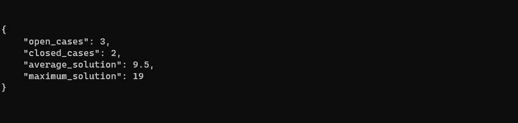
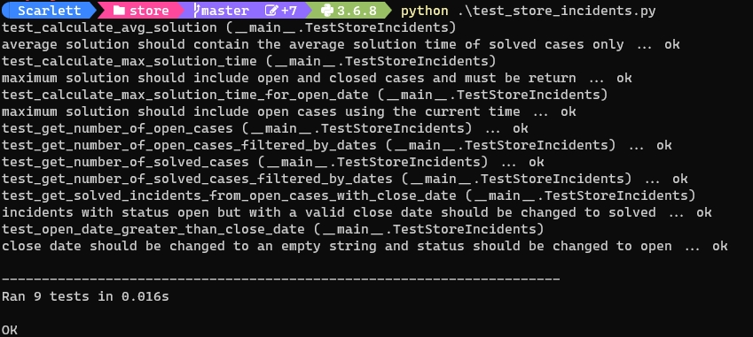

# Store Incidents

## Tabla de contenido
------------
* [Info General](#info-general)
* [Tecnología](#tecnología)
* [Ejecución](#ejecución)
* [Descripción de Archivos](#descripción-de-archivos)
* [Uso](#uso)
* [Pruebas Unitarias](#pruebas-unitarias)


## Info General
------------
Coding Problem.

### Salida





	
## Tecnología
------------
El programa está creado con:
* Python version: 3.6.8


## Descripción de Archivos
------------

    ├── README.md                     <- Descripción e información útil del proyecto.
    ├── app.py                        <- Punto de entrada del proyecto.
    ├── incidents.py                  <- Agregar un poco de lógica y validaciones a las incidencias recibidas.
    ├── store.py                      <- Realiza los cálculos para el estatus de las incidencias.
    ├── test_store_incidents.py       <- Pruebas unitarias de métodos correspondientes a incidents y store.
    └── incidents_data.json           <- Datos de prueba para la ejecución.

	
## Ejecución
------------
Para ejecutar este programa:

```bash
python app.py
```

Para ejecutar las pruebas unitarias:
```bash
python test_store_incidents.py
```

## Uso
------------

```python
# retorna los datos de las incidencias desde un archivo json
incidents_data = _open_json(CURRENT_DIR_PATH, FILE_NAME)

# retorna una lista de incidencias ya mapeadas a objetos de tipo Incidents
some_incidents = list(map(lambda incident: Incidents(**incident), incidents_data))

# retorna una instancia de Store al que se le ha adjuntado las incidencias
some_store = Store(some_incidents)

# retorna el status de las incidencias filtrando por fechas
incident_status = some_store.incident_status('01/10/2022 00:00:00', '04/06/2022 12:59:59')
```

Los pueden cambiar los siguientes valores:
* La variable `FILE_NAME`, en caso de utilizar otros datos u otra fuente—sólo se debe de respetar la **estructura** del json.
* Los parámetros que se le pasan al método `incident_status(start_date, end_date)` son fechas (string) en formato m/d/Y H:M:S.

## Pruebas Unitarias
------------

Las pruebas unitarias realizadas cubren los casos base (funcionalidad principal) y algunos casos
de posibles errores en los datos de las incidencias. Estos últimos fueron planteado principalmente porque una alteraciónen la funcionalidad que comprueban altera la lógica del programa sobre los datos y con ello da un output errado.

### Casos base
```python
# verifica que se tomen en cuenta sólo los incidentes con status open en el rango recibido.
test_get_number_of_open_cases_filtered_by_dates()

# verifica que se tomen en cuenta sólo los incidentes con status open.
test_get_number_of_open_cases()

# verifica que se tomen en cuenta sólo los incidentes con status solved en el rango recibido.
test_get_number_of_solved_cases_filtered_by_dates()

# verifica que se tomen en cuenta sólo los incidentes con status solved.
test_get_number_of_solved_cases()

# verifica que el promedio de la solución sea correcta y que sólo tome en cuenta los incidentes con status solved.
test_calculate_avg_solution()

```


### Casos de posibles errores

```python
# verifica que close_date se cambie a una cadena vacía y el status del incidente sea open cuando open_date es mayor que close_date.
test_open_date_greater_than_close_date()

# verifica que los incidentes con status open que contengan close date sean cambiados a status solved.
test_get_solved_incidents_from_open_cases_with_close_date()

# verifica que el tiempo máximo (en horas) de la solución tome en cuenta a los incidentes que tienen status open.
test_calculate_max_solution_time_for_open_date()

```